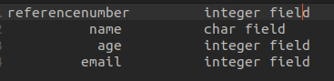
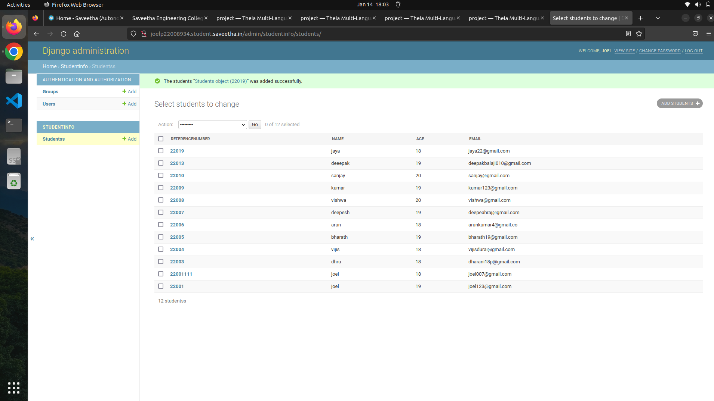

# Django ORM Web Application

## AIM
To develop a Django application to store and retrieve data from a database using Object Relational Mapping(ORM).

## Entity Relationship Diagram


## DESIGN STEPS

### STEP 1:
Create a new a new Django project using "django-admin startproject",get into the
project terminal and use "python3 manage.py startapp" command.

### STEP 2:

Define a model for the Employee details in the models.py . Allow host access and add
the app name under installed apps in settings.py

### STEP 3:

Define a model for the Employee details in the models.py . Allow host access and add
the app name under installed apps in settings.py

### STEP 4;
Run the python manage.py makemigrations and python manage.py migrate commands
to create the necessary database tables for the Employee details model.Run the server
using "python3 manage.py runserver 0:8000" command.

## PROGRAM
```
from django.db import models

#create your models here.
from django.db import models
from django.contrib import admin
# Create your models here.
class Students(models.Model):
    referencenumber = models.CharField(max_length=8,primary_key=True)
    name = models.CharField(max_length=100)
    age = models.IntegerField()
    email = models.EmailField()
    

class StudentAdmin(admin.ModelAdmin):

    list_display = ('referencenumber','name','age','email')
```
## OUTPUT




## RESULT
thus we developed a Django application to store and retrieve data from a database using Object Relational Mapping(ORM).